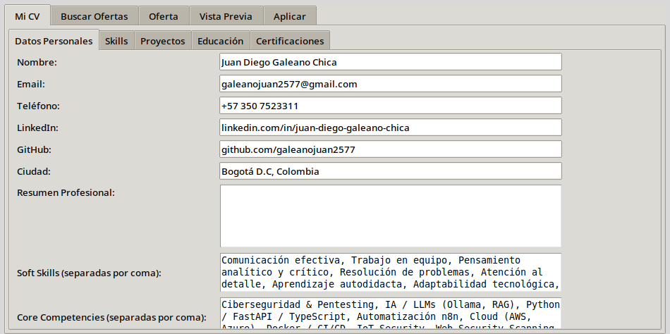
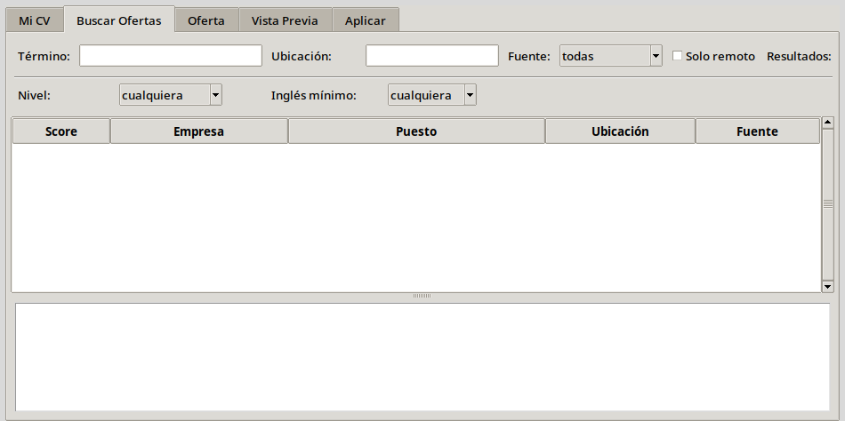
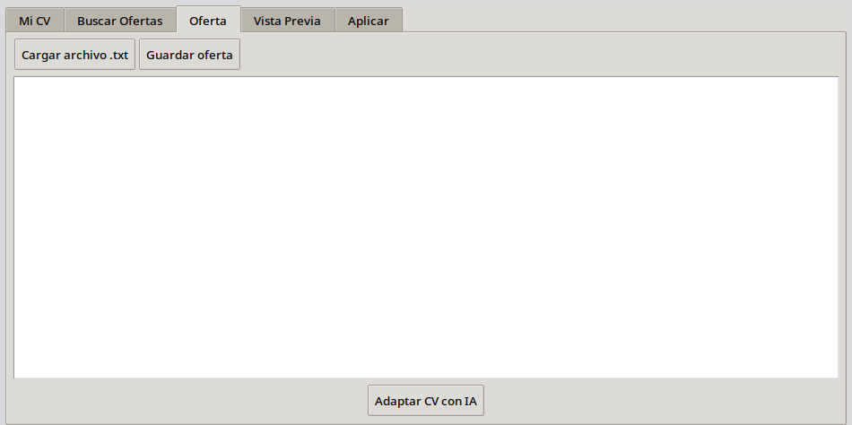
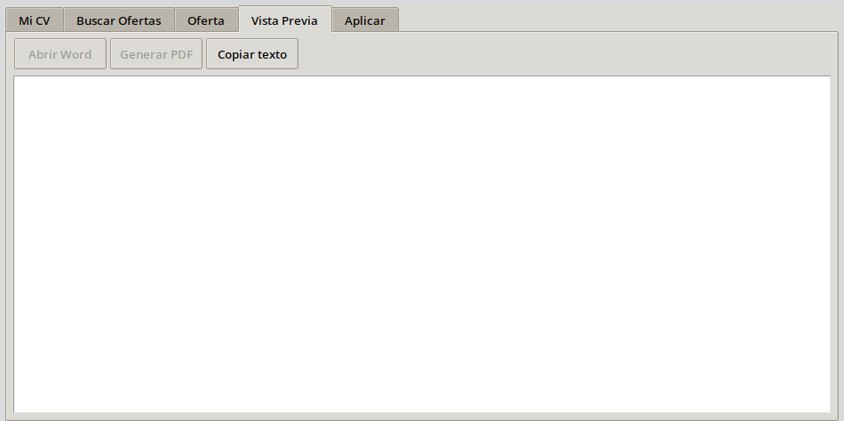
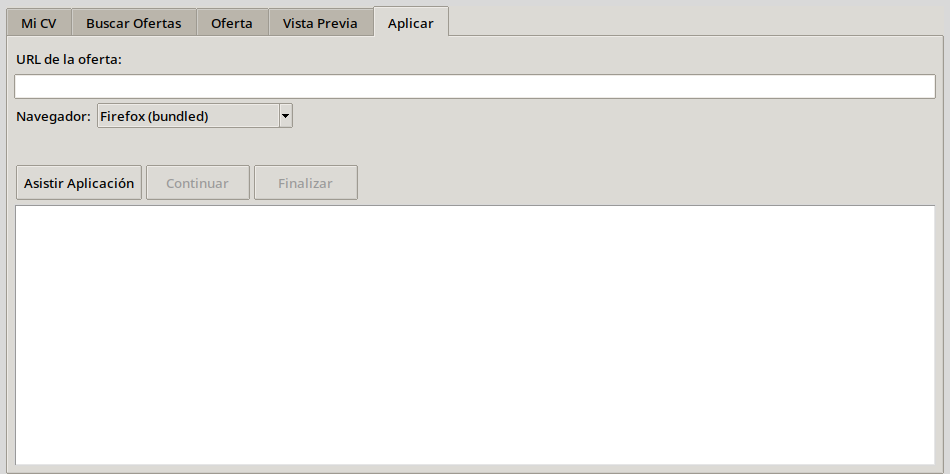
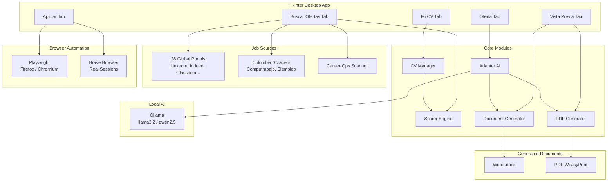

# CV Automat

<div align="center">

**Asistente de CV Inteligente — Búsqueda, Adaptación y Postulación Automatizada**

[]()
[]()
[]()
[]()
[]()
[]()

**CV Editor** • **Job Search** • **AI Adaptation** • **Document Generation** • **Auto-Apply**

</div>

---

## Screenshots

| CV Editor | Job Search | AI Adaptation |
|:---:|:---:|:---:|
|  |  |  |
| **Document Preview** | **Auto-Apply** | |
|  |  | |

---

## Architecture



---

## Features

- **CV Editor** — Full profile form: personal data, professional summary, skills by categories, projects with bullet points and impact statements, education, certifications (Credly import), and language proficiencies. Dual persistence in JSON + auto-export.

- **Intelligent Job Search** — Aggregates 28+ global job portals (LinkedIn, Indeed, Glassdoor, RemoteOK, WeWorkRemotely, ZipRecruiter) and Colombia-specific sources (LinkedIn CO, Computrabajo, Elempleo). Filters by location, experience level, remote-only, minimum English level.

- **Hybrid Scoring Engine** — Rule-based matching: skills (35%), projects (25%), core competencies (20%), education/certs (10%), soft skills (10%). Location bonuses (remote x1.15, hybrid x1.05). Optional AI re-scoring via Ollama (60% rules + 40% AI). Works for any job type, not just tech.

- **AI Adaptation (Local)** — Uses Ollama (`llama3.2`, fallback `qwen2.5:0.5b`) to adapt professional summary, reorder skills by relevance, and rewrite experience descriptions to emphasize applicable technologies. **Guarantees no fabricated information** — only reorders and re-emphasizes existing content. Zero cloud dependency.

- **Professional Document Generation** — **Word** (python-docx): dark blue header, competency chips with colored backgrounds, skill badges, project entries with formatted bullets. **PDF** (WeasyPrint HTML+CSS): A4 typographic layout, 2-column certifications, full CSS styling. Each adapted CV saved with the job offer name.

- **Assisted Job Application** — **Brave mode**: opens your real Brave browser with active sessions (no login blocks). **Playwright mode**: Firefox or Chromium with auto-form-filling (name, email, phone, CV upload). Portal-specific selectors for LinkedIn, Indeed, Computrabajo, Infojobs. Generic fallback selector patterns for other portals.

- **Credly Integration** — Import certifications directly from Credly API with badge metadata.

---

## Quick Start

### Requirements
- Python 3.10+
- Ollama with `llama3.2` model
- LibreOffice (optional, for DOCX→PDF)
- Playwright browsers (for automation)

### Automated Install
```bash
git clone https://github.com/galeanojuan2577/CV_Automat.git
cd CV_Automat
chmod +x instalar.sh && ./instalar.sh
trabajo
```

### Manual Install
```bash
git clone https://github.com/galeanojuan2577/CV_Automat.git
cd CV_Automat
python3 -m venv venv
source venv/bin/activate
pip install -r requirements.txt
pip install playwright weasyprint
playwright install firefox chromium
ollama pull llama3.2
python3 main.py
```

---

## Configuration

### Environment Variables

| Variable | Default | Description |
|---|---|---|
| `CV_AUTOMAT_DIR` | `~/Documentos/Personal/CV_Automat` | Project data directory |
| `CV_OUTPUT_DIR` | `~/Documentos/CV` | Generated CV output folder |
| `AUTO_CV_AGENT_DIR` | `~/auto-cv-agent` | Auto CV agent sync path |
| `CAREER_OPS_DIR` | `~/career-ops` | Career-ops scanner path |
| `OLLAMA_HOST` | `http://localhost:11434` | Ollama API endpoint |
| `OLLAMA_MODEL` | `llama3.2` | LLM model for adaptation |

### Scoring Weights

| Component | Weight |
|---|---|
| Skills matching | 35% |
| Projects matching | 25% |
| Core competencies | 20% |
| Education & certifications | 10% |
| Soft skills | 10% |

### Location Bonuses
| Type | Multiplier |
|---|---|
| Remote / WFH | x1.15 |
| Hybrid | x1.05 |
| Bogota (on-site) | x0.90 |
| Other city (on-site) | x0.70 |

---

## Tech Stack

| Layer | Technology |
|---|---|
| GUI | Python Tkinter + ttk (themed) |
| Local AI | Ollama (llama3.2 / qwen2.5:0.5b) |
| Document (Word) | python-docx |
| Document (PDF) | WeasyPrint (HTML+CSS → PDF) |
| Web Scraping | jobdrop library, requests + BeautifulSoup4 |
| Colombia Scrapers | requests + BeautifulSoup4 (LinkedIn CO, Computrabajo, Elempleo) |
| Browser Automation | Playwright (Firefox/Chromium) + Brave direct launch |
| Persistence | JSON (cv_base.json) + auto-sync |
| Scoring | Hybrid rule-based + AI (Ollama) |

---

## Project Structure

```
CV_Automat/
├── main.py                  # GUI entry point (Tkinter, 5 tabs)
├── config.py                # Central configuration (paths, models, scoring weights)
├── cv_manager.py            # CV persistence: JSON + auto-cv-agent sync
├── adaptador.py             # AI adaptation with Ollama
├── scorer.py                # Hybrid scoring engine (rules + AI)
├── buscador.py              # Job search orchestrator (28 sources)
├── scrapers_colombia.py     # Colombia-specific portal scrapers
├── aplicar.py               # Application assistant (Playwright + Brave)
├── generar_documento.py     # Word (.docx) generation
├── generar_pdf_html.py      # PDF generation via WeasyPrint
├── generar_cv_maestro.py    # Master CV template
├── credly_importer.py       # Credly certification import
├── requirements.txt         # Python dependencies
├── instalar.sh              # Automated install script
├── trabajo.sh               # Launch script
├── oferta_ejemplo.txt       # Example job offer
├── cv_base.json.example     # Empty CV template
├── .env.example             # Environment variables template
└── .gitignore
```

---

## License

MIT
